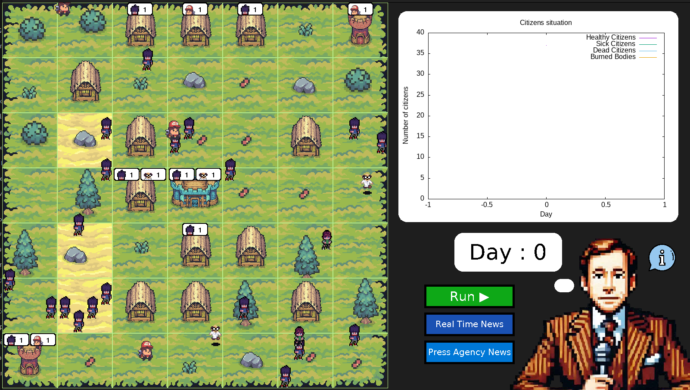
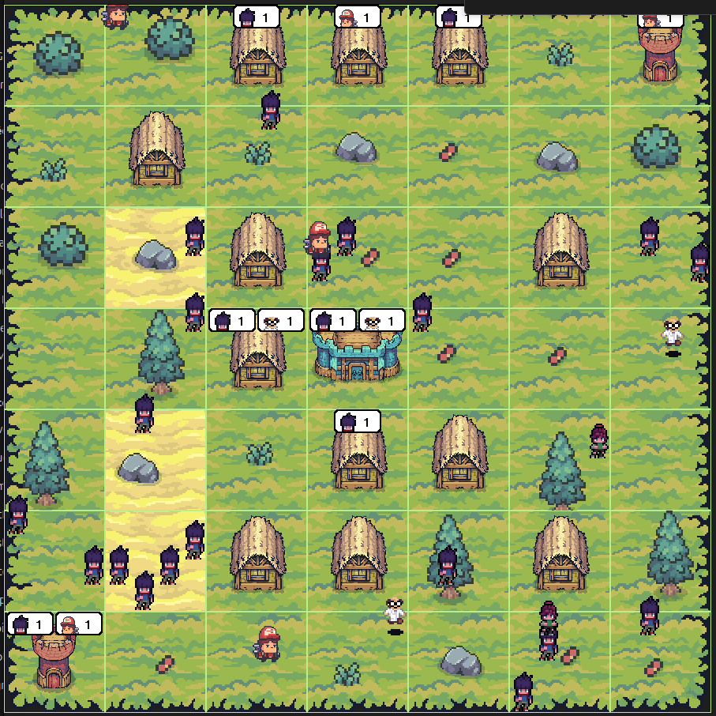
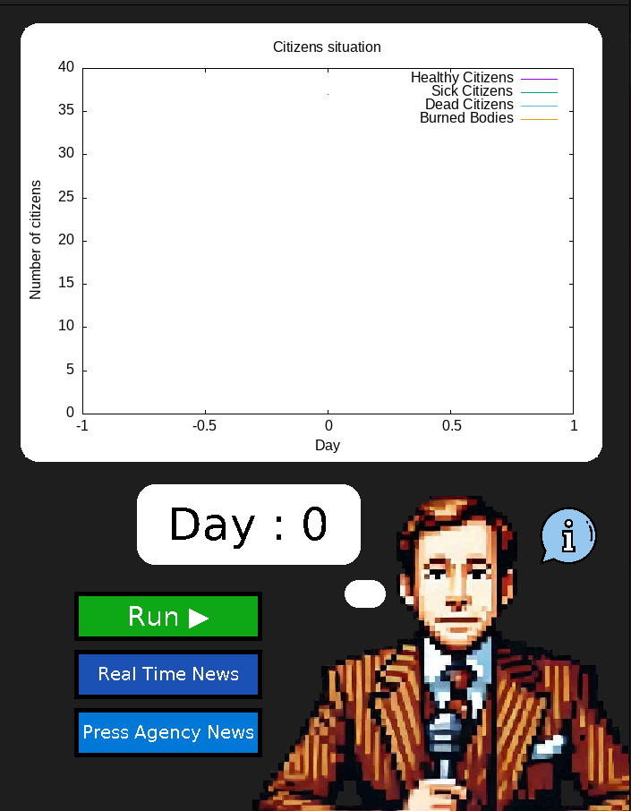
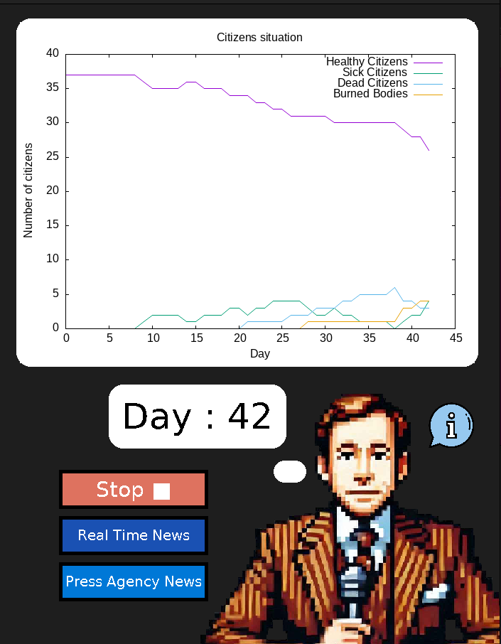
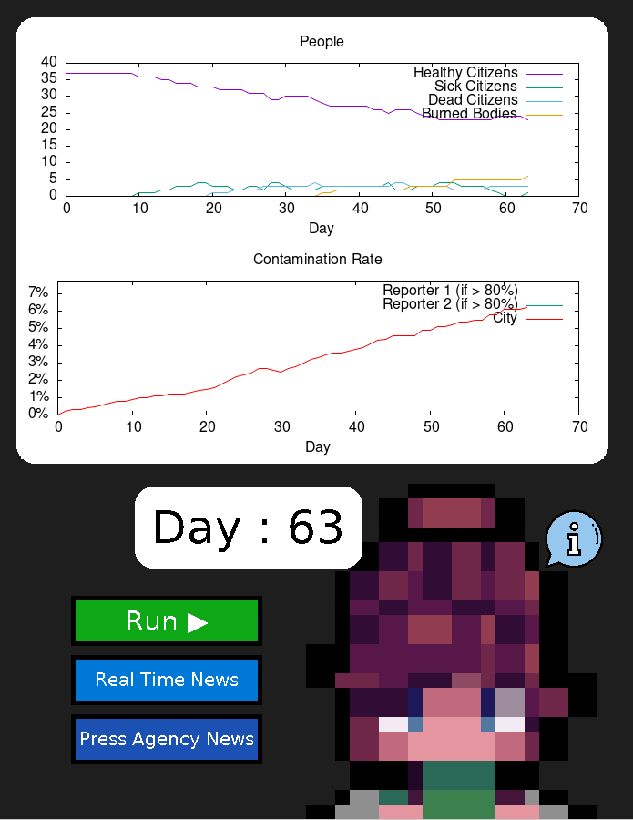
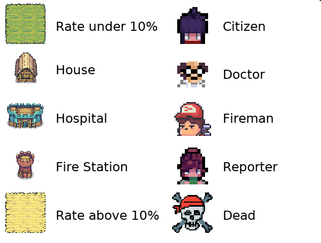

# Operating System Project

## **Project description:**

The aim of the project is to create an application that simulates the spread of a viral contamination in a city, as well as the fight against this contamination by some of its citizens, in order to put into practice the knowledge acquired in class.

The majority of the project was developed in C, with the exception of the graphics part, which was developed in Python. You will need Gnuplot.

This project contains several main folders:

- The `bin` folder with the executable.
- The `doc` folder contains information on the files used in the project and the report.
- The `include` folder contains the header files required for the project.
- The `resources` folder, which contains various resources used in the project such as images or generated files by programs.
- The `src` folder contains the source code used for the executables.


## **Deliverable:**

```
cd OSproject
make
```

It will compile all the executable, but if you want to compile just the executables for the simulation, type instead:
```
make exec
```
Or if you want only test:
```
make test
```
(you can launch them by issuing this command:)
```
./bin/test
```

\
The last step is to run the simulation by typing the following command:
```
./bin/launcher
```

Or type this command to compile and run simulation:
```
bash launch.sh 
```

\
You can either launch the four mains programs in different terminals.


## **How to use it:**

When you launch the program, you will be taken to this interface:

<div align="center"> 
     
</div> <br>

The section on the left shows how the city is evolving and how people are moving around.

<div align="center"> 
     
</div> <br>

The section on the right shows the evolution of contamination on graphs. There are also several buttons for launching the simulation, displaying the real data, the data sent by journalists, and displaying the legend.

<div align="center"> 
    
</div> <br>

To launch the simulation, click on the "Run ▶" button (you can stop it by clicking again).

To see the real values of the spread of contamination, select the "Real Time News" mode by clicking the corresponding button.

<div align="center"> 
    
</div> <br>

To see the values of the spread of contamination sent by reporters, select the "Press Agency News" mode by clicking  the corresponding button.

<div align="center"> 
     
</div> <br>

Finally, to see what the elements on the map correspond to, hover your mouse over the ‘i’ bubble.

<div align="center"> 
     
</div> <br>


## **Authors:**

- Lucie Chauvet <lucie.chauvet@ecole.ensicaen.fr>
- Mathis Dubuisson <mathis.dubuisson@ecole.ensicaen.fr>
- Audrey Leconte <audrey.leconte@ecole.ensicaen.fr>
- Valentin Salic <valentin.salic@ecole.ensicaen.fr>


## **Other useful commands:**

### **How to generate the documentation:**

In your computer's terminal, use the cd function to access the main folder and issue this command:
```
make doc
```


### **How to delete the object files:**

In your computer's terminal, use the cd function to access the main folder and issue this command:
```
make clean
```


### **How to delete test file:**

In your computer's terminal, use the cd function to access the main folder and issue this command:
```
make cleantest
```


### **How to delete all the files generated by the project:**

In your computer's terminal, use the cd function to access the main folder and issue this command:
```
make distclean
make cleandoc   # Clean the html folder in ./doc (used by the Gitlab pages)
```


